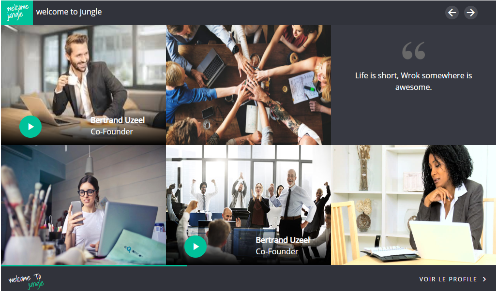

# widget
 this widget is a coding challenge by united remote for UI&UX developers 
 
# Preview

# how it work?
there is a hover on each element in the widget with smooth feeling of using it when you slide by clicking on the above right-left icons or using mouse and also there is an auto slide that run when you stop hovering on the widget content  every 10s  to slide from first card item to last one and start again with a progress bar in the bottom of the widget charged .

# Live Preview
[www.widget.com](https://widget-design.netlify.com)

# Easy installation in 2 steps
it's simple to use it!!
1. dwonload the project.
2. open index.html file in your browser.
3. Opss I forgot for last 3 step... ENJOY! ;)

Little explain for installation If the icons do not appear check your connection because i used online library icons link in the project 

# Platform Used
* HTML5
* CSS3
* JAVASCRIPT

# Conclusion

There are many more feature which are not added but the most thing i tried to do but i didn't finish it yet with pure javascript  is the mobile feeling  when you slide on mobile device 

